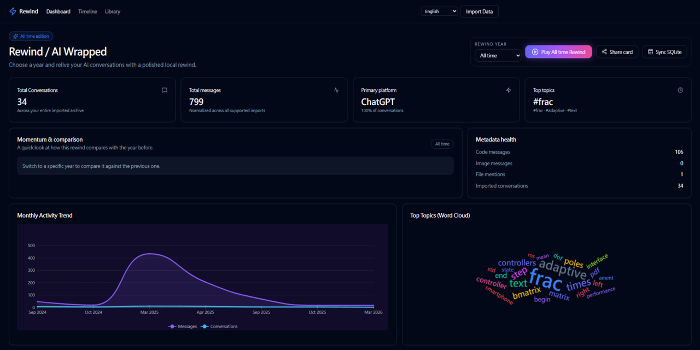
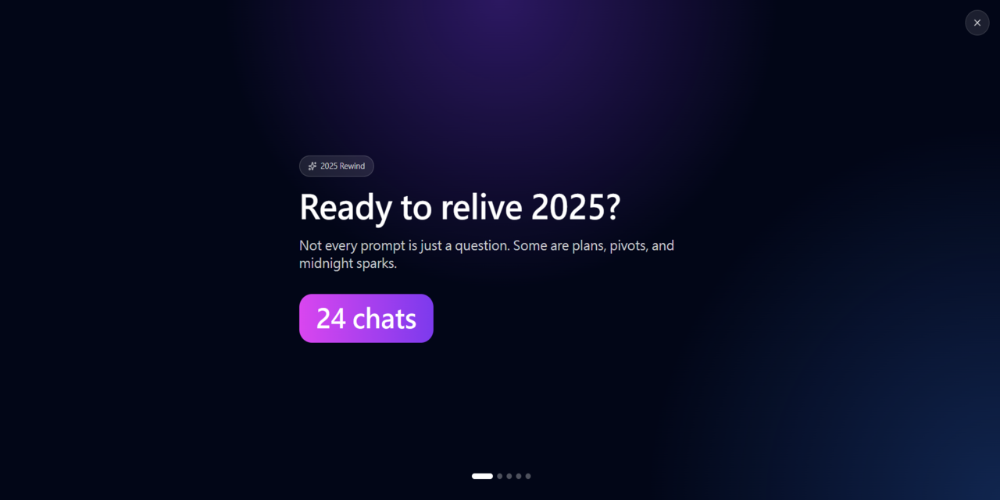
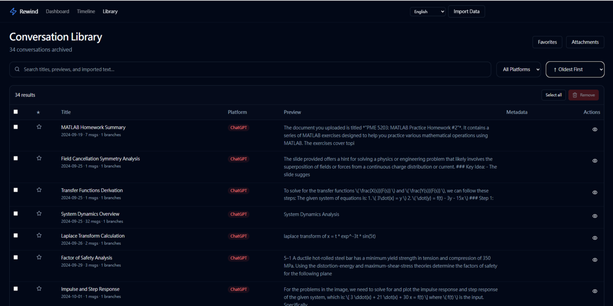
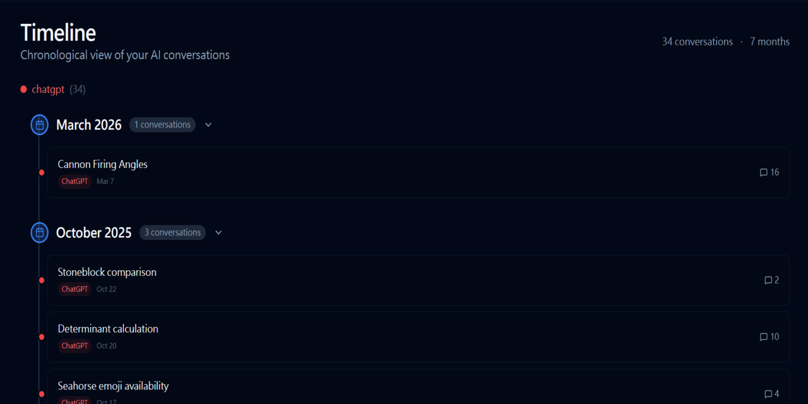
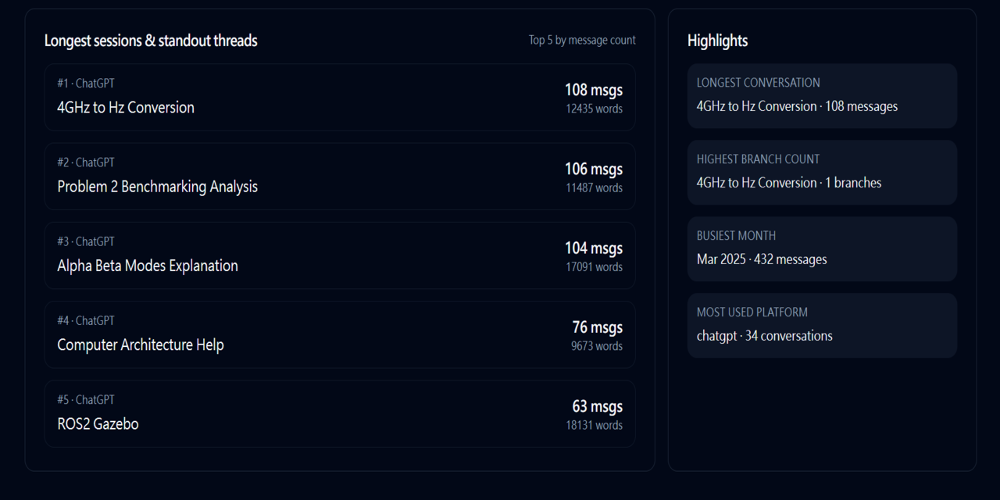

# Rewind for AI Chats

[English README](README.md) · [繁體中文 README](README.zh-TW.md)

> 一个以本地为核心、沉浸感十足的 AI 对话时光机。 
> 让你过去在 ChatGPT、Gemini、Claude 与 Grok 上的互动重新鲜活起来。

有时候，我们和 AI 的对话不只是一次次功能性的问答；它们也是思路的轨迹、头脑风暴的过程，以及灵感冒出的瞬间。 
**Rewind** 不只是一个「导出工具」——它更像是你的个人 AI 对话档案库。受到 Spotify Wrapped 与 YouTube Music Recap 那种漂亮的年度回顾体验启发，Rewind 会把你分散在不同平台上的 AI 对话汇整起来，并用一个令人惊艳、沉浸感十足的仪表盘重新呈现给你。 

通过词云、活动趋势、分支时间轴、跨年份比较，以及你最常聊的主题，重新回顾你的 AI 一年——而且一切都 100% 安全地保存在你的本地机器上。

## ✨ 功能特性

- 🎬 **可选年份的「Rewind」沉浸式故事模式**：以全屏、自动播放的方式呈现你所选年份的 AI 统计（常用平台、对话量、主题亮点等等）。
- 📊 **精美的分析仪表盘**：用高质感图表呈现你的每月消息趋势、平台依赖度、词云、重点对话，以及跨年份变化。
- 🌳 **支持分支的统一时间轴**：以壮观的「鸟瞰式」SVG 地图呈现你具分支结构的 AI 对话演化树。
- 📚 **强大的对话库**：可按多种条件筛选的数据表，方便搜索、排序、收藏与查看你归档下来的重要对话（支持日期、平台、附件、收藏，以及规范化后的 metadata）。
- 🖼️ **可分享的 Rewind 卡片**：把你所选年份的 Rewind 导出成一张整理好的摘要图片。
- 🔒 **100% 本地优先架构**：你的数据不会离开你的电脑。 
  - **浏览器档案库**：当前的 Web 版本会把规范化后的对话数据与 metadata 存储在 `localStorage`。
  - **持久化服务器**：已预先配置一个本地 API Node 服务器（`packages/api`），可将你的档案库写入本地 **SQLite** 数据库。
  - **数据库位置**：同步后的数据会存储在你本地文件系统中的 `packages/db/rewind.sqlite`。
  - **搜索基础**：SQLite 层已包含本地全文搜索基础，可供后续与 API 查询使用。
- ⚡ **跨平台 AI 支持**：目前支持 ChatGPT 与 Grok 的 JSON 导入，以及 ChatGPT / Gemini / Claude / Grok 的 HTML / MHTML 导入。
- 🚀 **流畅的导入向导**：通过打磨过的拖放式界面，快速导入 JSON 导出文件与原生浏览器保存文件（`.html`、`.htm`、`.mhtml`、`.mht`）。
- ☁️ **已准备好部署到 GitHub Pages 的 Web App**：Web App 现在使用 `HashRouter`，也已包含 Pages 部署 workflow。

## ✅ 功能矩阵

### 核心能力

| 功能 | 状态 | 说明 |
| --- | --- | --- |
| 沉浸式 Rewind 故事模式 | ✅ | 可选年份、多页面、支持多语言 |
| Dashboard 分析 | ✅ | 每月活动、平台占比、词云、亮点摘要 |
| 年度比较 | ✅ | 所选年份与前一年比较 |
| 对话库 | ✅ | 搜索、排序、收藏、附件、metadata 标签 |
| 可分享摘要卡片 | ✅ | 可把 Rewind 摘要导出成 PNG |
| 本地浏览器档案库 | ✅ | 数据本地存储在 `localStorage` |
| SQLite 同步 | ✅ | 可把导入档案同步到本地 API / SQLite |
| 本地搜索基础 | ✅ | 已包含 SQLite FTS 搜索端点 |
| GitHub Pages 部署 | ✅ | HashRouter + workflow 已配置 |

### 来源 / 格式支持

| 来源 | JSON 导入 | HTML / MHTML 导入 | 批量导出脚本 | 建议流程 |
| --- | --- | --- | --- | --- |
| ChatGPT | ✅ | ✅ | ✅ | 使用 userscript 或另存页面后导入 |
| Grok | ✅ | ✅ | ✅ | 使用 userscript 或另存页面后导入 |

注意：Grok 的另存页面（HTML / MHTML）导入只会保留当前可见的 branch，因为保存页面本身不包含隐藏 branch 的完整历史。

| Gemini | — | ✅ | — | 另存网页 → `.mhtml` |
| Claude | — | ✅ | — | 另存网页 → `.mhtml` |

## 📸 Screenshots

> 由于 UI/UX 调整相对频繁，请以 GitHub Pages 或本地部署画面作为主要参考。这里的截图偏向示意用途，不保证始终与最新界面完全一致。







## 🛠️ 在本地运行 App

这个项目目前已现代化为 **React + Vite + Tailwind CSS** 架构。

```bash
# 1. 安装依赖
npm install

# 2. 启动 Vite 开发服务器
npm run dev:web
```

然后前往 `http://localhost:4173/`，体验整个 dashboard。

如果你也想启用本地 SQLite 持久化与搜索基础，可以另外启动本地 API 服务器：

```bash
npm run dev --workspace @rewind/api
```

这会在 `http://localhost:8765/` 启动 Rewind Local API，而 dashboard 可通过 **Sync SQLite** 将数据同步进去。

## ☁️ 部署到 GitHub Pages
因为 Web App 使用 `HashRouter`，所以在静态托管环境下也能安全处理深层链接。

您可以在 GitHub Pages 在线试用此应用程序：[GitHub Pages](https://pme26elvis.github.io/rewind-for-ai-chats/)

## 🕷️ 批量导出 — 多平台主动抓取工具

如果你想一键批量导出 **ChatGPT 或 Grok** 上的所有对话：

1. 在浏览器中安装 [Tampermonkey](https://www.tampermonkey.net/)。
2. 打开 `packages/extension/rewind-batch-export.user.js`，并在 Tampermonkey 中点击 **Install**。
3. 前往 [chatgpt.com](https://chatgpt.com) 或 [grok.com](https://grok.com)。右下角会出现浮动的 **「⚡ Rewind Batch Export」** 面板。
4. 点击 **「🚀 Start Export」**。脚本会利用你当前的登录 session，通过内部 API 抓取完整的 JSON 对话树。
5. 解压后，把 `.json` 文件拖入 Rewind 的 **Import Data** 页面，即可导入你的档案库。

对于 **Gemini** 与 **Claude**，当前建议流程是：

1. 在浏览器中打开该对话。
2. 使用 **另存网页**。
3. 若可选，优先保存为 `.mhtml`。
4. 再把该文件导入 Rewind。

## 📜 致谢与授权

本项目最初受到 [Yalums/lyra-exporter](https://github.com/Yalums/lyra-exporter)（MIT License）启发。虽然本项目已大幅把重心从浏览器导出工具，转向一个独立、重视美感的本地分析仪表盘（也就是「Rewind」体验），但我们依然对原作者在 AI 聊天 DOM 抓取与通用 JSON 结构映射上的先驱逻辑，保有深深的感谢，并完整致上应有的 credit。
